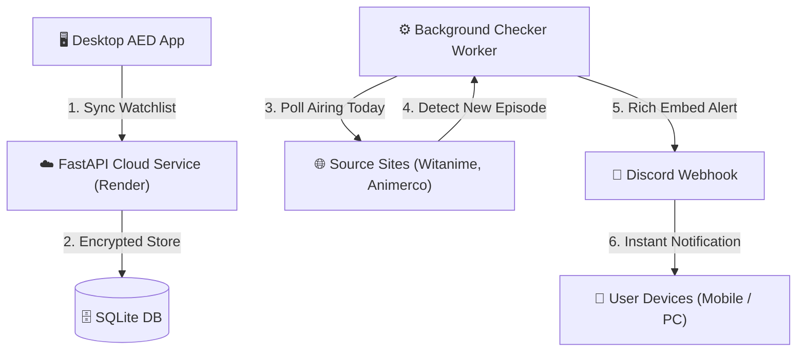

<div align="center">

# ⚡ Auto Episodes Downloader (AED)

**The modern, automated anime downloader and weekly release tracker with 24/7 Cloud Discord Notifications.**

[](https://github.com/ud7-a/autoDownloader/releases)
[](https://github.com/ud7-a/autoDownloader/actions)
[](https://python.org)
[](https://github.com/ud7-a/autoDownloader/releases)
[](LICENSE)

[Download Latest Release](https://github.com/ud7-a/autoDownloader/releases/latest) • [Features](#-features) • [Quick Start](#-quick-start) • [Cloud Service](#-247-cloud-discord-notifications) • [Architecture](#-architecture)

</div>

---

## 🌟 Overview

**Auto Episodes Downloader** is a high-performance desktop application designed to eliminate manual anime downloading. Powered by a native **WinUI 3 Fluent Dark Theme**, an intelligent **multi-threaded Selenium engine**, high-speed **Aria2c multi-connection downloading**, and a **24/7 Cloud Notification Microservice**, AED automates everything from search to playback.

---

## ✨ Features

### 🚀 High-Speed Multi-Stream Engine
- **Aria2c Integration**: Downloads with 16 parallel connections per episode for maximum bandwidth utilization.
- **Dynamic Concurrency**: Automatically benchmarks your network speed and tunes simultaneous downloads on the fly.
- **Automatic UnRAR**: Auto-detects, extracts, and organizes compressed video archives upon download completion.

### 📺 Watchlist & Weekly Release Schedule
- **Follow with 1 Click**: Track ongoing anime series directly from the integrated search tab.
- **Airing Today Auto-Filter**: Automatically scrapes weekly release schedules (`witanime`, `animerco`) to highlight what's airing today.
- **Batch Download**: One-click download of all newly released unwatched episodes in sequence.

### ☁️ 24/7 Cloud Discord Notifications (PC Off Support)
- **Zero-Config Webhook Alerts**: Receive instant Discord alerts with rich media embeds whenever a new episode airs.
- **Offline Monitoring**: Powered by a dedicated cloud backend deployed on Render—you receive notifications even when your PC is turned off.
- **Privacy & Security First**: Discord webhooks are encrypted at rest with **Fernet (AES-128-CBC + HMAC-SHA256)** and never logged.
- **Shared Deduplication**: Scrapes each anime only once per cycle regardless of follower count.

### 🛡️ Smart Anti-Adblock & CAPTCHA Bypass
- Integrated **uBlock Origin Lite** extension silently blocks aggressive popups, redirects, and malware.
- Built-in CAPTCHA solving integration (2Captcha, Anti-Captcha, CapMonster).

---

## 📥 Quick Start

### Option A: Standalone Setup Installer (Recommended)
1. Download **`AutoDownloader_Setup.exe`** from the [Latest Release](https://github.com/ud7-a/autoDownloader/releases/latest).
2. Run the installer. It installs cleanly into `%LOCALAPPDATA%` and creates a desktop shortcut.
3. The app includes a **silent auto-updater** that keeps your installation up to date automatically!

### Option B: Portable ZIP Package
1. Download **`AutoDownloader_Portable.zip`**.
2. Extract to any folder and run `AutoDownloader.exe`.

---

## 🏗️ Architecture



---

## 🛠️ Development & Building from Source

### Prerequisites
- Python 3.13+
- Windows 10/11
- Google Chrome installed

### Local Setup
```bash
# 1. Clone the repository
git clone https://github.com/ud7-a/autoDownloader.git
cd autoDownloader

# 2. Install dependencies
pip install -r requirements-dev.txt

# 3. Run the desktop application
python main.py
```

### Running Tests & Linter
```bash
# Run unit tests
python -m unittest discover -s tests -v

# Run cloud service tests
python -m unittest discover -s service/tests -v

# Run code linter
python tools/lint.py
```

### Building the Binary
```bash
python tools/build_release.py
```

---

## 🚢 Publishing Releases

To release a new version, simply run our automated release helper:

```bash
python publish.py
```
*Prompts for version bump, stages changes, updates configuration, and triggers GitHub Actions to build and ship the release.*

---

## 📄 License

Distributed under the **MIT License**. See [`LICENSE`](LICENSE) for more details.
