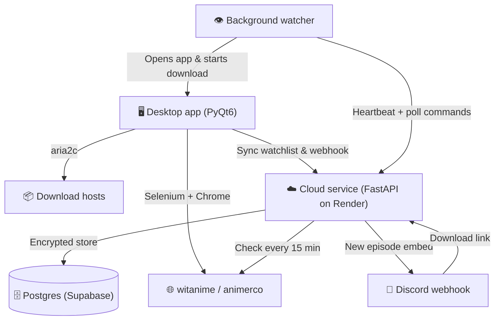

<div align="center">

# ⚡ Auto Episodes Downloader (AED)

**A Windows desktop app that finds, downloads and plays anime episodes — with a weekly watchlist, Discord alerts that work while your PC is off, and an mpv.net player with upscaling shaders.**

[](https://github.com/ud7-a/autoDownloader/releases)
[](https://github.com/ud7-a/autoDownloader/actions)
[](https://python.org)
[](https://github.com/ud7-a/autoDownloader/releases)
[](LICENSE)

[Download Latest Release](https://github.com/ud7-a/autoDownloader/releases/latest) • [Features](#-features) • [Quick Start](#-quick-start) • [Cloud Notifications](#%EF%B8%8F-discord-notifications--remote-downloads) • [Architecture](#%EF%B8%8F-architecture) • [Development](#%EF%B8%8F-development--building-from-source)

</div>

---

## 🌟 Overview

**Auto Episodes Downloader** automates the whole loop: search an anime, follow it, get told when a new episode is out, download it in the best available quality, and watch it in a tuned player. It is built with **PyQt6 + Fluent Widgets** (Windows 11 dark theme), drives Chrome with **Selenium** to find each episode's download link, and downloads with **aria2c**.

**Supported sites:** [witanime](https://witanime.site) and [animerco](https://eta.animerco.org).

---

## ✨ Features

### 🔎 Search & profiles
- **Search both sites** with cover art, pagination, and a **MOVIE** badge on films.
- **One click to a download profile**: loading a show creates a profile from the site's template, so there is nothing to configure.
- **Profile Manager**: each profile is a set of *automation paths* (one per mirror — e.g. Mediafire, Google Drive, gofile) tried in priority order, plus a **Smart Browser Picker** to build new paths by clicking in a real browser. Import/export profiles as JSON.

### ⬇️ Downloading
- **aria2c multi-connection downloads** (up to 16 connections per episode, stepping down automatically on hosts that throttle).
- **Smart concurrency**: picks how many episodes download at once from your measured speed, or set a fixed number.
- **Mirror check first**: before clicking anything, the app checks which download mirrors an episode actually offers and only tries those, in your profile's order.
- **Skip filler episodes**: uses the sites' own filler tags (`فلر` on animerco, `فيلر` on witanime), with a cross-site fallback when one site doesn't tag a show.
- **Archives handled**: `.rar`, `.7z` and `.zip` episodes are extracted automatically.
- **Ad and popup blocking** in the automation browser (ad requests are blocked natively, no extension needed), so mis-clicks on overlay ads don't derail a download.
- **Pause with control**: while paused you can change concurrency and hidden/visible browser mode, and skip any episodes that haven't started — from a fast episode grid (click, drag across, Shift+click a range, or type `13-40, 45`).
- **Resume after a crash or restart**: an unfinished session is offered on the next launch.

### 📚 Library
- **Watching / Watch later / Completed**: every anime you download or save from Search, with a **Continue watching** strip that plays the next episode in one click.
- **Tracks what you watched automatically**: episodes played in mpv.net are ticked off (90% in counts as watched), even when the app is closed — a small mpv.net script notes each episode you play and the Library catches up when it opens.
- **Brings in what you already have**: on first open it adds every anime in your download folder, with what mpv.net says you've already watched, and looks up their posters.
- **Per-anime history and sources**: each anime keeps its own download history, and each episode shows the site it was downloaded from.
- **Continue downloading**: one click downloads the episodes the site has that aren't on disk yet.

### 📺 Watchlist & release schedule
- **Follow with one click** from Search; cards show cover, site and new-episode count.
- **Grouped by weekday** from the sites' release schedules, with **today** first; on launch the app checks only what airs today (and again every 30 minutes).
- **Download all new** episodes across the watchlist in one go, or pick a subset per anime.

### ☁️ Discord notifications & remote downloads
- **Alerts while your PC is off**: a small cloud service (FastAPI on Render) checks followed anime every 15 minutes and posts a rich Discord embed when a new episode airs.
- **Download from Discord**: each alert has a download link. If your PC is on, the background watcher opens the app and starts that download within seconds; the alert shows whether your PC is online.
- **Private by design**: webhooks are encrypted at rest with **Fernet** (AES-128-CBC + HMAC-SHA256) and never logged; download links are HMAC-signed.
- **Shared checking**: each anime is fetched once per cycle no matter how many people follow it.
- *Note:* animerco blocks requests from cloud servers, so cloud alerts are dependable for **witanime**; animerco shows are still checked by the app itself while your PC is on.

### 🎬 Video Player (mpv.net)
- **Detects mpv.net** and **installs it through winget** with one click if it's missing.
- **Quality shaders**, applied in one click (your existing mpv.net config is backed up first):
  - **Anime** — Anime4K (clamp highlights → restore → 2× upscale → thin lines), used for files in your anime download folder.
  - **Series & movies** — FSRCNNX 2× + KrigBilateral + SSimDownscaler + adaptive sharpen.
  - Shortcuts in mpv.net: **F1** anime profile · **F2** series profile · **Ctrl+1** shaders off/on · **P** show active shaders.
- **Play downloads in mpv.net**: "Start Watching" and the Library open mpv.net directly, with the following episodes queued as a playlist.
- **Make mpv.net the default player** for `.mp4` and `.mkv` from the same tab.
- Shaders need a dedicated GPU; see [`assets/mpvnet/THIRD_PARTY.txt`](assets/mpvnet/THIRD_PARTY.txt) for their licenses.

### 🖥️ Works on any screen
- **Responsive layout** from small laptops (860×520 window, e.g. 1080p at 150% scaling) up to 1440p and wider, where each tab sits in a centred column instead of stretching edge to edge.
- **Touch screens**: finger drags scroll every page and list (with a fling), taps click, and a drag never triggers the button it started on.

---

## 📥 Quick Start

### Option A: Setup installer (recommended)
1. Download **`AutoDownloader_Setup.exe`** from the [latest release](https://github.com/ud7-a/autoDownloader/releases/latest).
2. Run it. The app installs to `C:\Auto Episodes Downloader\App` and adds a desktop shortcut; your settings, profiles and history live in `C:\Auto Episodes Downloader`.
3. When a new version is released the app offers to update itself on launch.

### Option B: Portable ZIP
1. Download **`AutoDownloader_Portable.zip`**.
2. Extract it anywhere and run `AutoDownloader.exe`.

**Requires:** Windows 10/11 and Google Chrome. mpv.net is optional (the Video Player tab can install it).

---

## 🏗️ Architecture


```mermaid
graph TD
    A["🖥️ Desktop app (PyQt6)"] -->|"Selenium + Chrome"| S["🌐 witanime / animerco"]
    A -->|"aria2c"| H["📦 Download hosts"]
    A -->|"Sync watchlist & webhook"| B["☁️ Cloud service (FastAPI on Render)"]
    B -->|"Encrypted store"| C[("🗄️ Postgres (Supabase)")]
    B -->|"Check every 15 min"| S
    B -->|"New episode embed"| F["🔔 Discord webhook"]
    F -->|"Download link"| B
    W["👁️ Background watcher"] -->|"Heartbeat + poll commands"| B
    W -->|"Opens app & starts download"| A
```

| Path | What lives there |
|---|---|
| `main.py` | App entry point; also runs as the background watcher with `--watcher` |
| `ui/` | Tabs (downloader, search, watchlist, library, profile manager, video player, active tasks), layout and touch helpers |
| `core/` | Selenium download engine, concurrency controller, filler detection, ad blocking, watcher, updater |
| `utils/` | Config/storage, mpv.net integration, Discord sender, crash/error reporting |
| `service/` | The cloud notification service (FastAPI, Postgres) and its tests |
| `assets/` | Icons, sounds, and the bundled mpv.net config + shaders |
| `tools/` | Build, version-bump and lint scripts; bundled `aria2c.exe` / `unrar.exe` |

---

## 🛠️ Development & Building from Source

### Prerequisites
- Python 3.13
- Windows 10/11
- Google Chrome

### Local setup
```bash
git clone https://github.com/ud7-a/autoDownloader.git
cd autoDownloader
pip install -r requirements-dev.txt
python main.py
```

Set `AED_APP_DIR` to a folder of your choice to run against separate test data instead of `C:\Auto Episodes Downloader`.

### Tests & linter
```bash
python -m unittest discover -s tests -v          # desktop app
python -m unittest discover -s service/tests -v  # cloud service
python tools/lint.py
```

### Building
```bash
python tools/build_release.py             # app + single-file installer in dist/
python tools/build_release.py --app-only  # just dist/AutoDownloader/
```

---

## 🚢 Publishing Releases

```bash
python publish.py
```
*Prompts for the version bump, commits and tags the release, and pushes; GitHub Actions then builds the installer and portable ZIP and attaches them to the release.*

---

## 📄 License

Distributed under the **MIT License**. See [`LICENSE`](LICENSE) for details. Bundled shaders keep their own licenses ([`assets/mpvnet/THIRD_PARTY.txt`](assets/mpvnet/THIRD_PARTY.txt)).
